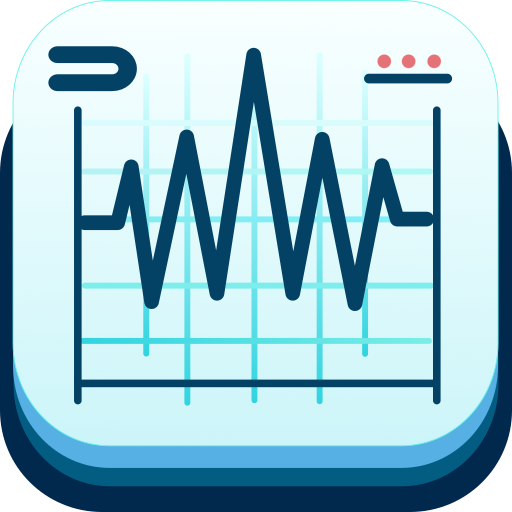

<p align="center">
<picture>

</picture>
<h1 align="center">Chronnotate</h1>
</p>

Application for labeling time-series data.

## Installing

Ensure you have Python 3.11 installed, and preferrably use environment (venv, conda).

1. Clone the repo
2. Install required dependencies (`[dev]` for development tools, like linter and formatter): `pip install .[dev]`
3. Launch the app by running `chronnotate`.

## Building executable

It is also possible to distribute the app as a single executable, holding all the dependencies.
Such executable can be created with `pyinstaller`:

```
pyinstaller src/chronnotate.py --onefile --windowed --icon="ui/resources/icon.ico" --exclude PySide6
```

## How to use

1. Load CSV file
2. Select the signals that you want to show during labeling from the list on the left side
3. Add labels in the bottom
4. Select label(s) from the list and add them by left mouse click and dragging on the main plot area

The main plot can be scaled by holding the right mouse click and moving in x or y axis direction.
Panning is possible by clickin on the third mouse button (mouse-wheel) and dragging in the plot area.